# Advanced PD Model API

> **Enterprise-grade Probability of Default modeling with regulatory compliance**

[](https://python.org)
[](https://fastapi.tiangolo.com)
[](#regulatory-compliance)
[](#regulatory-compliance)
[](LICENSE)

A production-ready system for calculating Probability of Default (PD) scores across retail, SME, and corporate banking segments. Features comprehensive web interface, API endpoints, batch processing, and full regulatory compliance.

## 🎮 **Live Demo**

**Try the application online**: [https://probability-default.onrender.com/](https://probability-default.onrender.com/)

- ✨ **No installation required** - Access directly from your browser
- 🔒 **Secure sandbox environment** - Safe to experiment with real-like data
- 📱 **Mobile responsive** - Works on all devices
- 🌓 **Theme switching** - Try both light and dark modes
- ⚡ **Full functionality** - All features available including batch processing

*Note: Demo may take 30-60 seconds to wake up from sleep mode on first visit.*

## 🌟 Key Features

### 🏦 **Multi-Segment Modeling**
- **Retail Banking**: Individual consumers and personal loans
- **SME Banking**: Small and medium enterprises  
- **Corporate Banking**: Large corporations and institutional clients

### 📊 **Advanced Analytics**
- **37+ Risk Factors**: Comprehensive feature engineering per segment
- **Ensemble Models**: Logistic Regression + Random Forest
- **Real-time Scoring**: Sub-100ms response times
- **Risk Grading**: AAA to C scale with IFRS 9 staging

### 🛡️ **Regulatory Compliance**
- **Basel III**: Minimum PD floors (3 basis points)
- **IFRS 9**: Automated staging (1, 2, 3) and ECL calculation
- **Audit Trail**: Complete prediction traceability
- **Model Governance**: Comprehensive validation framework

### 🌐 **Complete Web Interface**
- **Interactive Forms**: Guided data entry with real-time validation
- **Batch Processing**: CSV upload for portfolio-level analysis
- **Dark/Light Theme**: Accessible design with theme switching
- **Mobile Responsive**: Optimized for all device sizes
- **Progress Tracking**: Real-time processing updates

### ⚡ **Production Ready**
- **FastAPI Framework**: High-performance async API
- **Auto-Documentation**: OpenAPI/Swagger integration
- **Error Handling**: Comprehensive validation and error reporting
- **Template Downloads**: Pre-formatted CSV templates
- **Performance Monitoring**: Built-in health checks

## 🚀 Quick Start

### Option 1: Try the Live Demo (Recommended)
🌐 **Instant Access**: [https://probability-default.onrender.com/](https://probability-default.onrender.com/)

No installation needed! Try all features including:
- Individual PD scoring for all segments
- Batch processing with CSV upload
- Interactive web interface with real-time validation
- API documentation and testing

### Option 2: Local Installation

#### Prerequisites
- Python 3.8+
- 8GB RAM minimum
- Modern web browser

#### Installation

1. **Clone the repository**
```bash
git clone https://github.com/Ismat-Samadov/probability_default.git
cd probability_default
```

2. **Create virtual environment**
```bash
python -m venv venv
source venv/bin/activate  # On Windows: venv\Scripts\activate
```

3. **Install dependencies**
```bash
pip install -r requirements.txt
```

4. **Generate sample data** (Optional - for demo/testing)
```bash
cd data
python generator.py
cd ..
```

5. **Train models** (Optional - pre-trained models included)
```bash
cd training
python train_models.py
cd ..
```

6. **Start the application**
```bash
python app.py
```

7. **Open your browser**
```
http://localhost:8000
```

## 📁 Project Structure

```
probability_default/
├── app.py                     # Main FastAPI application
├── data/                      # Generated datasets
│   ├── generator.py          # Synthetic data generation
│   ├── retail/              # Retail customer data
│   ├── sme/                 # SME company data
│   ├── corporate/           # Corporate entity data
│   ├── macroeconomic/       # Economic indicators
│   ├── time_series/         # Historical data
│   ├── stress_test_*.csv    # Stress testing scenarios
│   ├── data_dictionary.csv  # Data documentation
│   └── field_descriptions.txt # Feature descriptions
├── models/                   # Trained ML models
│   ├── retail/              # Retail segment models
│   ├── sme/                 # SME segment models
│   ├── corporate/           # Corporate segment models
│   ├── model_performance_summary.png # Performance visualization
│   └── training_report.txt  # Training summary
├── training/                 # Model training scripts
│   └── train_models.py      # Complete training pipeline
├── templates/               # Web UI templates
│   ├── base.html           # Base template with theme support
│   ├── index.html          # Homepage
│   ├── retail.html         # Retail customer form
│   ├── sme.html            # SME company form
│   ├── corporate.html      # Corporate entity form
│   ├── batch.html          # Batch processing interface
│   ├── results.html        # Results display
│   └── error.html          # Error handling
├── static/                  # Web assets
│   ├── css/style.css       # Complete styling with dark mode
│   ├── js/app.js           # Frontend JavaScript
│   └── favicon_io/         # Favicon and PWA assets
├── tests/                   # Test suite
│   ├── test_models.py      # Model functionality tests
│   ├── test_api.py         # API endpoint tests
│   ├── test_file_upload.py # File upload tests
│   ├── feature_checker.py  # Feature compatibility checks
│   ├── startup.py          # Startup verification
│   └── create_templates.py # Template generation
└── requirements.txt         # Python dependencies
```

## 🎯 Usage Guide

### Web Interface

#### 1. **Individual Scoring**
Navigate to the appropriate segment:
- **Retail**: `/retail` - Score individual customers
- **SME**: `/sme` - Score small/medium enterprises  
- **Corporate**: `/corporate` - Score large corporations

#### 2. **Batch Processing**
- Visit `/batch` for bulk processing
- Download CSV templates for proper formatting
- Upload files up to 10MB with 10,000 records max
- Real-time progress tracking with detailed results

#### 3. **API Integration**
Access comprehensive API documentation:
- **Live Demo API**: [https://probability-default.onrender.com/api/docs](https://probability-default.onrender.com/api/docs)
- **Local Installation**: `/api/docs`

### API Endpoints

> 🌐 **Test Live**: Try these endpoints at [https://probability-default.onrender.com/api/docs](https://probability-default.onrender.com/api/docs)

#### **Individual Predictions**
```python
# Retail Customer
POST /api/predict/retail
{
    "age": 35,
    "income": 75000,
    "credit_score": 720,
    "debt_to_income": 0.35,
    "utilization_rate": 0.25
}

# SME Company  
POST /api/predict/sme
{
    "industry": "Technology",
    "annual_revenue": 1500000,
    "num_employees": 25,
    "current_ratio": 1.8,
    "debt_to_equity": 0.8
}

# Corporate Entity
POST /api/predict/corporate
{
    "industry": "Financial Services", 
    "annual_revenue": 5000000000,
    "num_employees": 15000,
    "current_ratio": 1.5,
    "debt_to_equity": 0.7
}
```

#### **Batch Processing**
```python
POST /api/predict/batch
Content-Type: multipart/form-data
- file: CSV file
- segment: "retail" | "sme" | "corporate"
```

#### **Template Downloads**
- `GET /api/templates/retail.csv`
- `GET /api/templates/sme.csv` 
- `GET /api/templates/corporate.csv`

#### **Health Check**
```python
GET /api/health
# Returns model status and regulatory compliance info
```

### Response Format

```json
{
    "customer_id": "RETAIL_001",
    "segment": "retail",
    "pd_score": 0.0234,
    "risk_grade": "BBB",
    "ifrs9_stage": 1,
    "basel_compliant": true,
    "prediction_timestamp": "2024-01-15T10:30:00",
    "model_version": "1.0.0",
    "model_details": {
        "segment": "retail",
        "basel_floor_applied": true,
        "ensemble_method": "simple_average"
    }
}
```

## 🧠 Model Architecture

### **Training Pipeline**

The model training process follows a comprehensive pipeline designed for enterprise-grade risk modeling:

```mermaid
graph TD
    A[🚀 Start Training Pipeline] --> B[📊 Load Raw Data]
    
    B --> C[📋 Data Validation]
    C --> D{Data Quality Check}
    D -->|❌ Fail| E[🔧 Data Cleaning & Repair]
    D -->|✅ Pass| F[🔄 Feature Engineering]
    E --> F
    
    F --> G[👥 Retail Features<br/>37 variables]
    F --> H[🏢 SME Features<br/>31 variables]
    F --> I[🏛️ Corporate Features<br/>40 variables]
    
    G --> J[📈 Credit Score Calculation]
    H --> K[📊 Business Score Calculation]
    I --> L[⭐ Corporate Rating Calculation]
    
    J --> M[🌍 Add Macroeconomic Features]
    K --> M
    L --> M
    
    M --> N[🔀 Data Splitting<br/>60% Train / 20% Val / 20% Test]
    
    N --> O[🤖 Model Training]
    
    O --> P[📊 Logistic Regression<br/>High Interpretability]
    O --> Q[🌳 Random Forest<br/>Non-linear Patterns]
    
    P --> R[🎯 Model Calibration]
    Q --> R
    
    R --> S[🔄 Cross-Validation<br/>5-Fold Stratified]
    
    S --> T[📏 Model Evaluation]
    T --> U[📊 Performance Metrics<br/>AUC, Gini, KS, Brier]
    
    U --> V{Performance Check}
    V -->|❌ Below Threshold| W[🔧 Hyperparameter Tuning]
    V -->|✅ Acceptable| X[🎭 Ensemble Creation]
    W --> O
    
    X --> Y[⚖️ Basel III Compliance<br/>Apply 3bp Floor]
    Y --> Z[📋 IFRS 9 Staging<br/>Risk Classification]
    
    Z --> AA[💾 Model Persistence<br/>Save Models & Preprocessors]
    AA --> BB[📊 Generate Performance Charts]
    BB --> CC[📄 Create Training Report]
    
    CC --> DD[✅ Training Complete]
    
    style A fill:#e1f5fe
    style DD fill:#c8e6c9
    style D fill:#fff3e0
    style V fill:#fff3e0
    style Y fill:#f3e5f5
    style Z fill:#f3e5f5
```



### **Feature Engineering Details**

Each segment undergoes sophisticated feature engineering to capture domain-specific risk factors:

**Retail (37 features)**:
- Demographics, income, employment status
- Credit history, utilization patterns, payment behavior
- Banking relationships, transaction patterns
- Derived financial ratios and risk indicators
- Behavioral scoring and stability metrics

**SME (31 features)**:
- Business fundamentals and industry analysis
- Financial ratios and liquidity metrics
- Cash flow analysis and working capital management
- Payment history and credit utilization
- Geographic and competitive risk factors
- Management quality assessment

**Corporate (40 features)**:
- Advanced financial ratios and market metrics
- Credit ratings and ESG scores
- Geographic diversification and regulatory factors
- Complex cash flow and capital structure analysis
- Market position and competitive advantages

### **Ensemble Modeling Strategy**
- **Primary Algorithm**: Logistic Regression for interpretability and regulatory compliance
- **Secondary Algorithm**: Random Forest for capturing non-linear patterns and interactions
- **Combination Method**: Simple average with probability calibration
- **Validation Framework**: 5-fold stratified cross-validation with temporal holdout

### **Model Performance**


| Segment | AUC Score | Gini | KS Statistic | Default Rate | Sample Size |
|---------|-----------|------|--------------|--------------|-------------|
| Retail | 0.844 | 0.688 | 0.587 | 1.61% | 50,000 |
| SME | 0.747 | 0.494 | 0.421 | 3.99% | 10,000 |
| Corporate | 0.770 | 0.540 | 0.463 | 1.45% | 2,000 |

**Performance Characteristics**:
- **Discrimination**: Strong separation between good and bad customers
- **Calibration**: Well-calibrated probability estimates
- **Stability**: Consistent performance across different time periods
- **Regulatory Compliance**: Meets Basel III and IFRS 9 requirements

## 🛡️ Regulatory Compliance

### **Basel III Framework**
- ✅ **Minimum PD Floor**: 3 basis points applied to all predictions
- ✅ **Risk-Weighted Assets**: Compatible with IRB approach
- ✅ **Stress Testing**: Multiple economic scenarios included
- ✅ **Model Validation**: Independent validation framework

### **IFRS 9 Classification**
- **Stage 1**: PD ≤ 1% → 12-month ECL
- **Stage 2**: 1% < PD ≤ 5% → Lifetime ECL  
- **Stage 3**: PD > 5% → Lifetime ECL (credit-impaired)

### **Risk Grading Scale**
| Grade | PD Range | Description |
|-------|----------|-------------|
| AAA | 0-0.25% | Excellent credit quality |
| AA | 0.25-0.5% | Very good credit quality |
| A | 0.5-1% | Good credit quality |
| BBB | 1-2.5% | Adequate credit quality |
| BB | 2.5-5% | Moderate credit risk |
| B | 5-10% | High credit risk |
| CCC | 10-25% | Very high credit risk |
| CC | 25-50% | Extremely high risk |
| C | >50% | Near certain default |

## 🧪 Testing

### **Try Online First**
🌐 Test all functionality at [https://probability-default.onrender.com/](https://probability-default.onrender.com/) before local setup.

### **Local Testing**
Run the comprehensive test suite:

```bash
# Test model functionality
python tests/test_models.py

# Test API endpoints  
python tests/test_api.py

# Test file upload capabilities
python tests/test_file_upload.py

# Check feature compatibility
python tests/feature_checker.py

# Startup verification
python tests/startup.py

# Generate CSV templates
python tests/create_templates.py
```

## 📊 Data Generation

Generate synthetic datasets for training and testing:

```bash
cd data
python generator.py
```

**Generated Datasets**:
- **Retail**: 50,000 customers with realistic credit profiles
- **SME**: 10,000 companies across 12 industry sectors
- **Corporate**: 2,000 large enterprises with complex financials
- **Macroeconomic**: 10 years of monthly economic indicators
- **Stress Testing**: Baseline, adverse, and severely adverse scenarios
- **Time Series**: Historical portfolio performance data

**Data Documentation**:
- `data_dictionary.csv`: Complete data dictionary with field definitions
- `field_descriptions.txt`: Detailed feature descriptions
- `data_generation_report.txt`: Generation process summary

## 🏗️ Model Training

Retrain models with new data:

```bash
cd training
python train_models.py
```

**Training Pipeline Features**:
1. **Data Loading & Validation**: Comprehensive data quality checks
2. **Feature Engineering**: 100+ features per segment with domain expertise
3. **Model Training**: Ensemble of interpretable and complex algorithms
4. **Performance Validation**: Cross-validation and holdout testing
5. **Regulatory Compliance**: Basel III floors and IFRS 9 staging
6. **Model Persistence**: Automated saving of models and preprocessors
7. **Performance Reporting**: Detailed metrics and visualizations
8. **Documentation**: Complete training reports and model cards

**Training Outputs**:
- **Models**: Trained models for each segment (`models/*/`)
- **Performance Chart**: Visual performance summary (`models/model_performance_summary.png`)
- **Training Report**: Comprehensive training documentation (`models/training_report.txt`)

## 🎨 Web Interface Features

### **Modern Design**
- **Dark/Light Theme**: Automatic and manual theme switching
- **Responsive Layout**: Mobile-first design principles
- **Progressive Web App**: Installable with offline capabilities
- **Accessibility**: WCAG 2.1 compliant with screen reader support

### **User Experience**
- **Multi-step Forms**: Guided data entry with validation
- **Real-time Feedback**: Input validation with helpful hints
- **Progress Tracking**: Visual progress indicators for batch processing
- **Export Options**: JSON, CSV, and PDF result formats

### **Advanced Features**
- **Auto-complete**: Smart defaults based on user input
- **Data Validation**: Client-side and server-side validation
- **Error Recovery**: Graceful error handling with recovery options
- **Performance Monitoring**: Real-time API health status

## ⚙️ Configuration

### **Environment Variables**
```bash
# Optional configuration
export PD_MODEL_DEBUG=true          # Enable debug mode
export PD_MODEL_LOG_LEVEL=INFO      # Set logging level
export PD_MODEL_MAX_BATCH_SIZE=10000 # Max batch processing size
```

### **Model Parameters**
Adjust in `app.py`:
```python
# Regulatory thresholds
BASEL_MIN_PD = 0.0003              # 3 basis points
IFRS9_STAGE1_THRESHOLD = 0.01      # 1%
IFRS9_STAGE2_THRESHOLD = 0.05      # 5%
```

## 🚀 Deployment

### **Development**
```bash
python app.py
# Runs on http://localhost:8000 with auto-reload
```

### **Production**
```bash
pip install gunicorn
gunicorn app:app -w 4 -k uvicorn.workers.UvicornWorker --bind 0.0.0.0:8000
```

### **Docker** (Optional)
```dockerfile
FROM python:3.11-slim
WORKDIR /app
COPY requirements.txt .
RUN pip install -r requirements.txt
COPY . .
EXPOSE 8000
CMD ["gunicorn", "app:app", "-w", "4", "-k", "uvicorn.workers.UvicornWorker", "--bind", "0.0.0.0:8000"]
```

## 📈 Performance Optimization

### **Response Times**
- **Individual Predictions**: <100ms
- **Batch Processing**: ~1,000 records/second
- **Memory Usage**: ~500MB base + ~1MB per 1,000 records

### **Scaling Recommendations**
- **CPU**: 4+ cores for production
- **Memory**: 8GB minimum, 16GB recommended
- **Storage**: SSD recommended for model loading
- **Load Balancer**: Multiple instances for high availability

## 🤝 Contributing

1. Fork the repository
2. Create a feature branch: `git checkout -b feature-name`
3. Commit changes: `git commit -am 'Add feature'`
4. Push to branch: `git push origin feature-name`
5. Create Pull Request

### **Development Setup**
```bash
# Install development dependencies
pip install -r requirements.txt
pip install pytest black flake8 mypy

# Run code formatting
black .

# Run linting
flake8 .

# Run type checking
mypy app.py
```

## 📜 License

This project is licensed under the MIT License - see the [LICENSE](LICENSE) file for details.

## 🆘 Support

### **Documentation**
- **Live Demo**: [https://probability-default.onrender.com/](https://probability-default.onrender.com/)
- **API Docs**: [https://probability-default.onrender.com/api/docs](https://probability-default.onrender.com/api/docs) (Swagger UI)
- **ReDoc**: [https://probability-default.onrender.com/api/redoc](https://probability-default.onrender.com/api/redoc) (Alternative documentation)
- **Local API Docs**: `/api/docs` (when running locally)

### **Common Issues**

**Models not loading?**
```bash
# Check if model files exist
ls -la models/*/

# Retrain if needed
cd training && python train_models.py
```

**CSV upload failing?**
- Ensure file is UTF-8 encoded
- Check column names match templates
- Verify file size <10MB and <10,000 rows

**Performance issues?**
- Increase system memory
- Use SSD storage for model files
- Consider horizontal scaling

### **Getting Help**
- 🐛 **Issues**: [GitHub Issues](https://github.com/yourusername/probability_default/issues)
- 📖 **Documentation**: Comprehensive API docs at `/api/docs`

## 🔮 Roadmap

### **Upcoming Features**
- [ ] **Real-time Model Monitoring**: MLOps integration
- [ ] **Advanced Explainability**: SHAP/LIME integration
- [ ] **Multi-language Support**: Internationalization
- [ ] **Advanced Analytics**: Portfolio risk analytics
- [ ] **API Rate Limiting**: Enhanced security features
- [ ] **Webhook Integration**: Event-driven architecture

### **Model Enhancements**
- [ ] **Deep Learning Models**: Neural network integration
- [ ] **Time Series Features**: Temporal pattern recognition
- [ ] **Alternative Data**: Social media, satellite data
- [ ] **Ensemble Optimization**: Advanced model combining
- [ ] **Continuous Learning**: Online model updates

---

**Built with ❤️ for the financial services industry**

*This system provides enterprise-grade PD modeling capabilities with full regulatory compliance, making it suitable for banks, credit unions, and financial institutions of all sizes.*